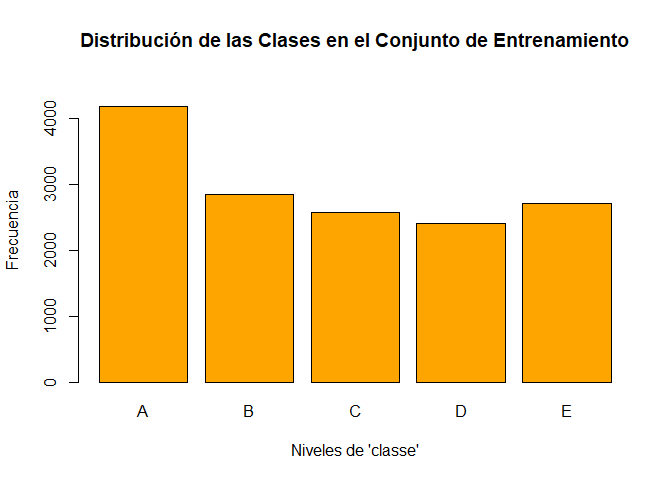
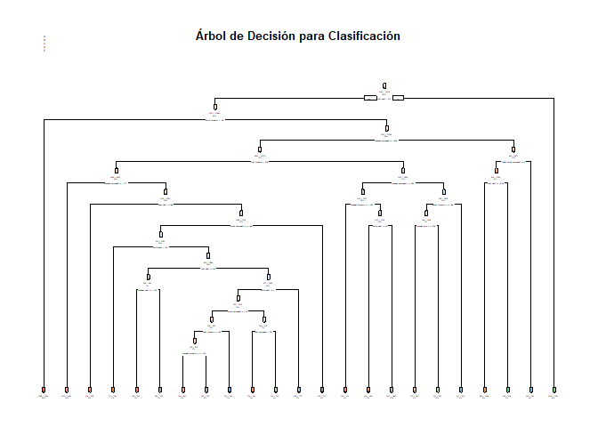

#Synopsis

### **`En este proyecto, usarás datos de acelerómetros de seis participantes que realizaron levantamientos de pesas de manera correcta e incorrecta en cinco formas distintas. El objetivo es predecir la manera en la que se realizó el ejercicio, indicada por la variable classe en el conjunto de entrenamiento`**.

Los dispositivos de seguimiento personal, como Fitbit y Nike FuelBand, permiten medir la actividad física diaria. Sin embargo, medir solo la cantidad de actividad no siempre refleja la calidad de la misma.

En este proyecto, utilizamos datos de acelerómetros en dispositivos colocados en el cinturón, el antebrazo, el brazo y la mancuerna de seis participantes que realizaron levantamientos de barra en cinco estilos diferentes. El objetivo es analizar estos datos para identificar patrones y evaluar la calidad de los levantamientos, tanto correctos como incorrectos.

## *Descripción de los datos*

La variable de salida es `classe`, un factor con 5 niveles que indican la forma en que se realizó el ejercicio:

-   Clase A: Correctamente según la especificación.
-   Clase B: Lanzando los codos hacia adelante.
-   Clase C: Levantando la mancuerna solo hasta la mitad.
-   Clase D: Bajando la mancuerna solo hasta la mitad.
-   Clase E: Lanzando las caderas hacia adelante.


``` r
# Variables de datos
training.file   <- './data/pml-training.csv'
test.cases.file <- './data/pml-testing.csv'
training.url    <- 'http://d396qusza40orc.cloudfront.net/predmachlearn/pml-training.csv'
test.cases.url  <- 'http://d396qusza40orc.cloudfront.net/predmachlearn/pml-testing.csv'
```

#### Procesamiento de Datos Se descargan y procesan los datos. Se eliminan columnas irrelevantes y se omiten valores NA


``` r
# Creación de directorios
if (!file.exists("data")){
  dir.create("data")
}
if (!file.exists("data/submission")){
  dir.create("data/submission")
}
```


``` r
# Cargar paquetes requeridos
#if (!require("caret")) install.packages("caret", dependencies=TRUE)
#if (!require("randomForest")) install.packages("randomForest", dependencies=TRUE)
#if (!require("rpart")) install.packages("rpart", dependencies=TRUE)
#if (!require("rpart.plot")) install.packages("rpart.plot", dependencies=TRUE)
library(caret)
```

```
## Warning: package 'caret' was built under R version 4.4.1
```

```
## Cargando paquete requerido: ggplot2
```

```
## Cargando paquete requerido: lattice
```

``` r
library(randomForest)
```

```
## Warning: package 'randomForest' was built under R version 4.4.1
```

```
## randomForest 4.7-1.1
```

```
## Type rfNews() to see new features/changes/bug fixes.
```

```
## 
## Adjuntando el paquete: 'randomForest'
```

```
## The following object is masked from 'package:ggplot2':
## 
##     margin
```

``` r
library(rpart)
library(rpart.plot)
```

```
## Warning: package 'rpart.plot' was built under R version 4.4.1
```


``` r
# Establecer semilla para la reproducibilidad
set.seed(9999)
```


``` r
# Verificar si los archivos ya existen, si no, descargarlos
if (!file.exists(training.file)) {
  download.file(training.url, destfile = training.file)
}
if (!file.exists(test.cases.file)) {
  download.file(test.cases.url, destfile = test.cases.file)
}

# Leer los datos desde los archivos locales
#training <- read.csv(training.file, na.strings=c("NA","#DIV/0!", ""))
#testing <- read.csv(test.cases.file, na.strings=c("NA", "#DIV/0!", ""))
```


``` r
training <- read.csv(training.file, na.strings=c("NA","#DIV/0!", ""))
testing <- read.csv(test.cases.file, na.strings=c("NA", "#DIV/0!", ""))
```


``` r
# Eliminar columnas irrelevantes y omitir valores NA
training <- training[, colSums(is.na(training)) == 0]
testing <- testing[, colSums(is.na(testing)) == 0]
```


``` r
# Eliminar las primeras 7 columnas que no son necesarias
training <- training[, -c(1:7)]
testing <- testing[, -c(1:7)]
```


``` r
# Dividir datos para validación cruzada
subSamples <- createDataPartition(y=training$classe, p=0.75, list=FALSE)
subTraining <- training[subSamples, ] 
subTesting <- training[-subSamples, ]
```


``` r
#subTesting$classe
```


``` r
table(subTraining$classe)
```

```
## 
##    A    B    C    D    E 
## 4185 2848 2567 2412 2706
```

## Análisis Exploratorio

#### *Visualizamos la distribución de la variable `classe` en el conjunto de entrenamiento.*


``` r
# Calcular las frecuencias de cada valor en 'classe'
frequencias <- table(subTraining$classe)

# Crear el gráfico de barras
barplot(frequencias,
        col="orange",
        main="Distribución de las Clases en el Conjunto de Entrenamiento",
        xlab="Niveles de 'classe'",
        ylab="Frecuencia",
        ylim=c(0, max(frequencias) * 1.1)) # Ajustar el límite superior del eje y
```

<!-- -->


``` r
library(rpart)
library(caret) # Para confusionMatrix
library(rpart.plot)
```


## Modelos de Predicción

#### *`Aplicamos dos modelos de predicción: Árbol de Decisión y Bosque Aleatorio`*.

Árbol de Decisión


``` r
# Ajuste del modelo de Árbol de Decisión
modFitDT <- rpart(classe ~ ., data=subTraining, method="class")
```


``` r
# Predicción con Árbol de Decisión
predictDT <- predict(modFitDT, subTesting, type = "class")
```


``` r
# Asegurarse de que 'subTesting$classe' sea un factor
subTesting$classe <- factor(subTesting$classe)
```


``` r
# Asegurarse de que 'predictDT' sea un factor con los mismos niveles que 'subTesting$classe'
predictDT <- factor(predictDT, levels = levels(subTesting$classe))
```


``` r
# Visualizar el Árbol de Decisión
rpart.plot(modFitDT, main="Árbol de Decisión para Clasificación", extra=102, under=TRUE, faclen=0)
```

<!-- -->


``` r
# Matriz de Confusión para Árbol de Decisión
confusionMatrix(predictDT, subTesting$classe)
```

```
## Confusion Matrix and Statistics
## 
##           Reference
## Prediction    A    B    C    D    E
##          A 1247  212   23   83   30
##          B   32  530   73   23   73
##          C   35   96  695  112  121
##          D   60   66   46  532   46
##          E   21   45   18   54  631
## 
## Overall Statistics
##                                           
##                Accuracy : 0.7412          
##                  95% CI : (0.7287, 0.7534)
##     No Information Rate : 0.2845          
##     P-Value [Acc > NIR] : < 2.2e-16       
##                                           
##                   Kappa : 0.6712          
##                                           
##  Mcnemar's Test P-Value : < 2.2e-16       
## 
## Statistics by Class:
## 
##                      Class: A Class: B Class: C Class: D Class: E
## Sensitivity            0.8939   0.5585   0.8129   0.6617   0.7003
## Specificity            0.9008   0.9492   0.9101   0.9468   0.9655
## Pos Pred Value         0.7818   0.7250   0.6563   0.7093   0.8205
## Neg Pred Value         0.9553   0.8996   0.9584   0.9345   0.9347
## Prevalence             0.2845   0.1935   0.1743   0.1639   0.1837
## Detection Rate         0.2543   0.1081   0.1417   0.1085   0.1287
## Detection Prevalence   0.3252   0.1491   0.2159   0.1529   0.1568
## Balanced Accuracy      0.8974   0.7538   0.8615   0.8043   0.8329
```

Bosque Aleatorio


``` r
library(randomForest)

# Asegurarse de que 'classe' sea un factor
subTraining$classe <- factor(subTraining$classe)

# Ajuste del modelo de Bosque Aleatorio
modFitRF <- randomForest(classe ~ ., data=subTraining)

# Ver el resumen del modelo para asegurarse de que no haya errores
print(modFitRF)
```

```
## 
## Call:
##  randomForest(formula = classe ~ ., data = subTraining) 
##                Type of random forest: classification
##                      Number of trees: 500
## No. of variables tried at each split: 7
## 
##         OOB estimate of  error rate: 0.46%
## Confusion matrix:
##      A    B    C    D    E  class.error
## A 4183    1    0    0    1 0.0004778973
## B   10 2832    6    0    0 0.0056179775
## C    0   14 2551    2    0 0.0062329568
## D    0    0   25 2384    3 0.0116086235
## E    0    0    1    5 2700 0.0022172949
```


``` r
subTraining$classe <- as.factor(subTraining$classe)
```


``` r
# Predicción con Bosque Aleatorio
predictRF <- predict(modFitRF, subTesting, type = "class")
```


``` r
# Matriz de Confusión para Bosque Aleatorio
confusionMatrix(predictRF, subTesting$classe)
```

```
## Confusion Matrix and Statistics
## 
##           Reference
## Prediction    A    B    C    D    E
##          A 1393    5    0    0    0
##          B    2  943    2    0    0
##          C    0    1  853    8    0
##          D    0    0    0  795    2
##          E    0    0    0    1  899
## 
## Overall Statistics
##                                           
##                Accuracy : 0.9957          
##                  95% CI : (0.9935, 0.9973)
##     No Information Rate : 0.2845          
##     P-Value [Acc > NIR] : < 2.2e-16       
##                                           
##                   Kappa : 0.9946          
##                                           
##  Mcnemar's Test P-Value : NA              
## 
## Statistics by Class:
## 
##                      Class: A Class: B Class: C Class: D Class: E
## Sensitivity            0.9986   0.9937   0.9977   0.9888   0.9978
## Specificity            0.9986   0.9990   0.9978   0.9995   0.9998
## Pos Pred Value         0.9964   0.9958   0.9896   0.9975   0.9989
## Neg Pred Value         0.9994   0.9985   0.9995   0.9978   0.9995
## Prevalence             0.2845   0.1935   0.1743   0.1639   0.1837
## Detection Rate         0.2841   0.1923   0.1739   0.1621   0.1833
## Detection Prevalence   0.2851   0.1931   0.1758   0.1625   0.1835
## Balanced Accuracy      0.9986   0.9963   0.9977   0.9942   0.9988
```

Conclusion
Result
The Random Forest model demonstrates better performance compared to the Decision Tree. The accuracy for the Random Forest model was 99.57%, compared to 74.12% for the Decision Tree model. Therefore, the Random Forest model is chosen for the final prediction.

Expected Out-of-Sample Error
The expected out-of-sample error is estimated to be 0.43%. This is calculated as 1 - accuracy for the predictions made with the cross-validation set.


``` r
# Predicción final en el conjunto de prueba
predictSubmission <- predict(modFitRF, testing, type="class")
predictSubmission
```

```
##  1  2  3  4  5  6  7  8  9 10 11 12 13 14 15 16 17 18 19 20 
##  B  A  B  A  A  E  D  B  A  A  B  C  B  A  E  E  A  B  B  B 
## Levels: A B C D E
```

``` r
# Función para escribir los archivos de salida para la presentación
pml_write_files <- function(x){
  n <- length(x)
  for(i in 1:n){
    filename <- paste0("./data/submission/problem_id_", i, ".txt")
    write.table(x[i], file=filename, quote=FALSE, row.names=FALSE, col.names=FALSE)
  }
}

# Generar archivos de salida
pml_write_files(predictSubmission)
```

-------------------------------------------------------


